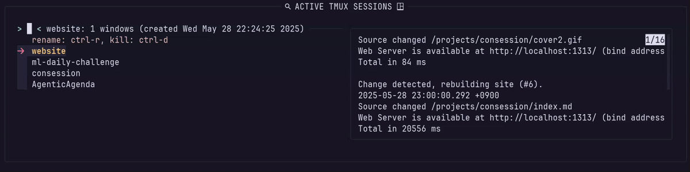

<!-- #host-reference -->
<h1 align="center">consession</h1>
<!-- markdownlint-disable-next-line -->
<p align="center">
  
</p>


---

**consession** is a **tmux session manager** powered by **fzf** and **zoxide**.
It effortlessly lets you create, switch, rename and kill sessions.
It knows the directories you visit most often and remembers every time you rename a session.

---

## 🚀 Features

- **Type and attach** fuzzy search over currly open tmux sessions.
- **Create new sessions** automatically from your frequently used directories (via zoxide).
- **Preview** of sessions and directory contents.
- **Keybindings** for renaming and killing sessions directly from the fzf interface.
- **Persistent Names** for sessions associated with a particular directory.



---


## 📦 Installation

- **Run the following commands**

   ```bash
   git clone https://github.com/itsfernnn/consession.git
   cd consession
   make install
   ```


- **Ensure dependencies are installed**

   - [tmux](https://github.com/tmux/tmux)
   - [fzf](https://github.com/junegunn/fzf)
   - [zoxide](https://github.com/ajeetdsouza/zoxide)
   - [eza](https://github.com/eza-community/eza) (optional, for directory preview icons)

---

## ⚙️ Usage

Simply run:

```bash
consession
```

By default, consession will:

1. Show a fuzzy list of your current tmux sessions.
2. Allow you to kill (`Ctrl-X`) or rename (`Ctrl-R`) any session.
3. Automatically switches to zoxide view when query does not match any existing session
4. Switch back to the session view by pressing `Backspace` on an empty query.
5. Switch to an existing session or create a new one in the selected directory by pressing `Enter`.

### Keybindings

| Action                 | Key Combination |
| ---------------------- | --------------- |
| Kill session           | Ctrl-X          |
| Rename session         | Ctrl-R          |
| Switch to zoxide view  | unique query    |
| Reset to sessions view | backspace       |
| create or switch session | enter           |

---

## 🛠 Configuration

`TODO`

---


## 📄 License

This project is licensed under the MIT License. See the [LICENSE](LICENSE) file for details.

---

## 🙏 Acknowledgements

- Inspired by fzf-tmux workflows
- Thanks to the maintainers of tmux, fzf, zoxide, and eza
